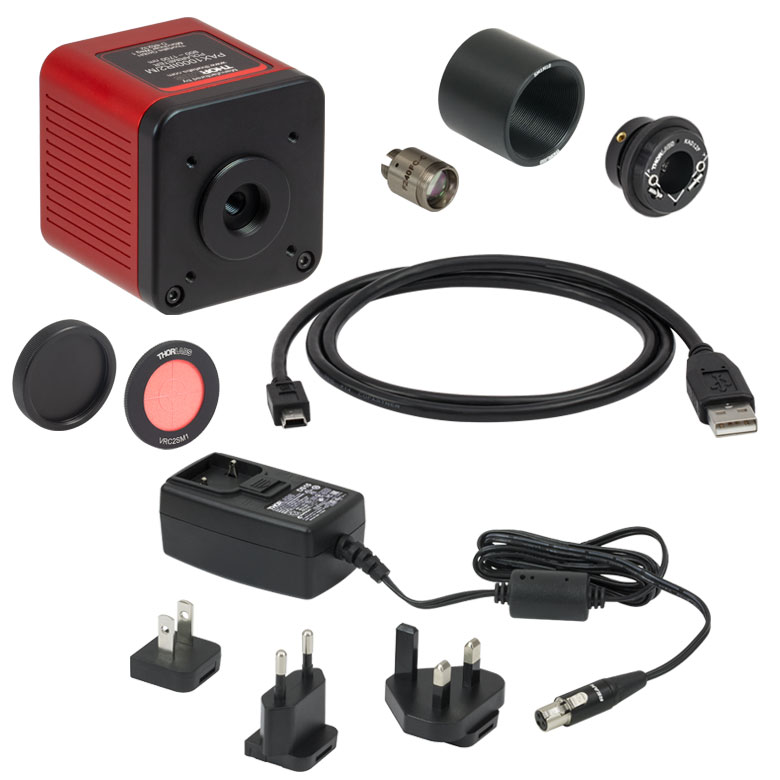
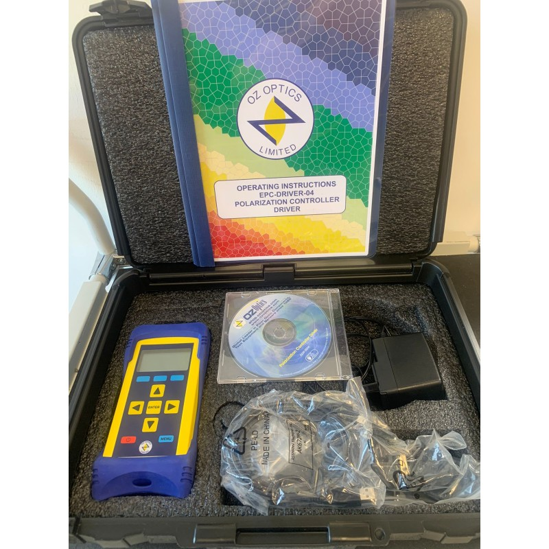
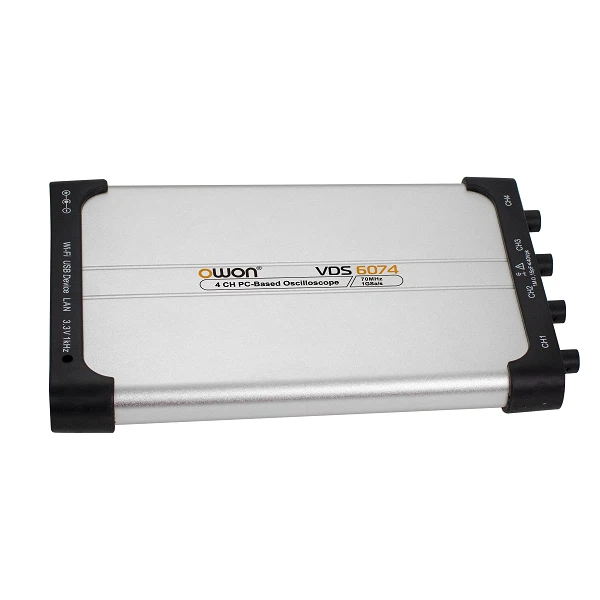
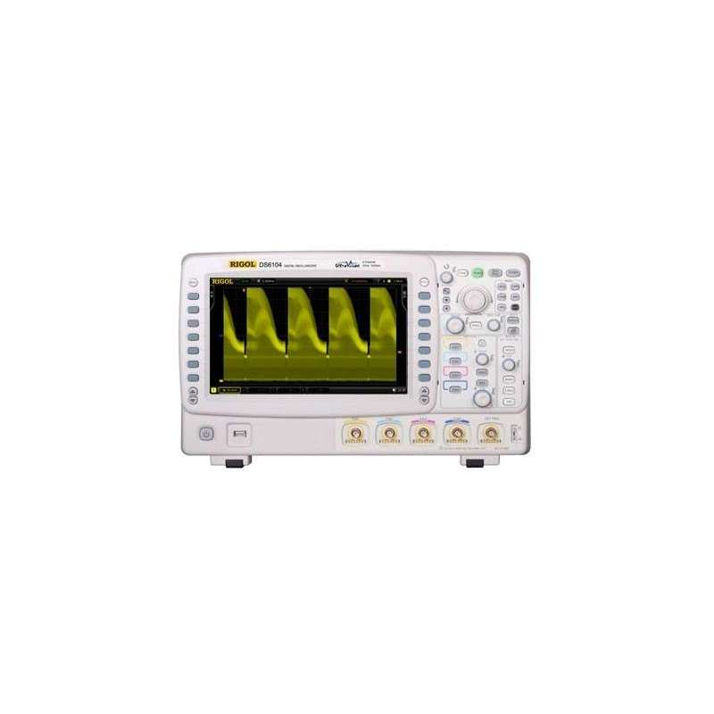

# polarization_controlling

**Pure Python APIs for Real-Time Polarization Control in Optical Setups**

---

## Overview

**polarization_controlling** is a Python toolkit designed to monitor and stabilize photon polarization in optical systems. It plays an essential role in quantum cryptography and classical photonic applications by ensuring that the desired polarization state is maintained—even in the face of inherent system imperfections such as instrument errors, birefringence, and thermal fluctuations.

In many quantum cryptography protocols (e.g., those involving the well-known Alice and Bob scenario), the polarization states of photons are used to generate secure keys. Any deviation from the intended state introduces errors, quantified as the **Quantum Bit Error Rate (QBER)**. Our API suite helps to quickly detect these deviations via integrated measurement devices and applies corrective feedback using electrical polarization controllers.

---

## Key Features

- **Real-Time Monitoring:**  
  Continuously tracks polarization using devices like oscilloscopes and polarimeters to assess system performance and QBER.

- **Automated Correction:**  
  Once the QBER exceeds a predefined threshold, the system calculates and applies optimal voltage adjustments to the fiber via a polarization controller.

- **Advanced Optimization Algorithms:**  
  Integrated optimizers based on Particle Swarm Optimization (PSO) and Simulated Annealing (SA) reduce correction times and maintain system stability.

- **Modular and Extensible:**  
  Designed with flexibility in mind, the APIs can easily accommodate new instruments or optimization methods, making them useful beyond polarization control applications.

---

## Experimental Setup

Instead of assembling a complex array of lasers, beam splitters, and detectors, our experimental prototype leverages a simplified yet highly effective configuration:
  
- **Measurement:**  
  An **Oscilloscope** measures the dynamic polarization fluctuations in the fiber.  
- **Adjustment:**  
  An **Electrical Polarization Controller** applies precise voltage changes to “squeeze” the fiber and restore the desired polarization state.
- **Verification:**  
  A **Polarimeter** acquires the light's polarization directly, providing essential feedback for continuous adjustment.

**How It Works:**  
The system initiates with light of a certain polarization from the transmitter. At the receiver side, it is expected that the polarization remains unchanged. In practice, any drift (due to imperfect components and environmental factors) is detected as an increased QBER. By implementing a prepare-and-measure configuration, the code continuously monitors for errors and, if necessary, automatically adjusts the polarization controller to correct the drift.

---

## Supported Hardware

The project has been tested with the following instruments:

- **Polarimeter:**  
  *ThorLabs PAX1000IR2*  
    


- **Polarization Controller:**  
  *OZ Optics 4-Channel EPC Polarization Controller with USB Driver*  
    


- **Oscilloscopes:**  
  - *OWON VDS6047 PC Oscilloscope*  
      

  - *RIGOL DS 6104 Oscilloscope*  
      


These instruments are interfaced and controlled via our Python APIs, allowing streamlined integration into your measurement or experimental setups.

---

## Getting Started

1. **Installation:**  
   Clone the repository and install the required Python packages:
   ```bash
   git clone https://github.com/your_username/polarization_controlling.git
   cd polarization_controlling
   pip install -r requirements.txt

---

## Usage Example
Check out the examples directory for scripts demonstrating:
-  Initialization of measurement devices.
-  Real-time QBER monitoring.
-  Feedback control using automated optimizers.

---

## Contributing
Contributions are highly welcome! Whether you’re reporting issues, suggesting improvements, or submitting pull requests, your input is invaluable. 
Please review our CONTRIBUTING.md for detailed contribution guidelines and best practices.

---

## References
 - [Optical polarization controllers for endless polarization control](https://opg.optica.org/oe/fulltext.cfm?uri=oe-22-7-8259&id=282433)    
  - [Electrical polarization control in optical fibres](https://digital-library.theiet.org/doi/abs/10.1049/el.2011.1522)  

